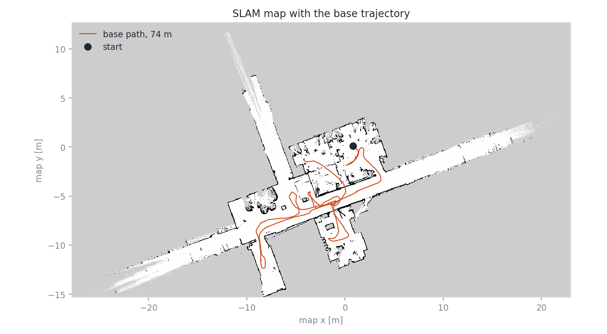
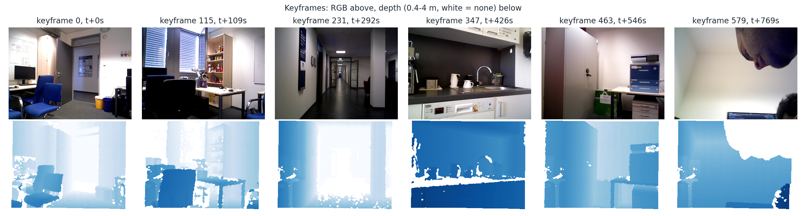
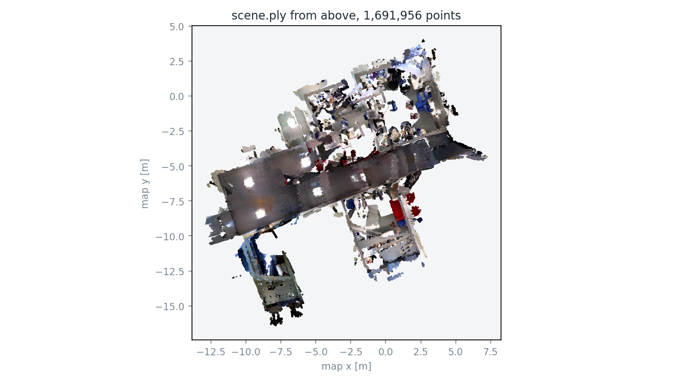
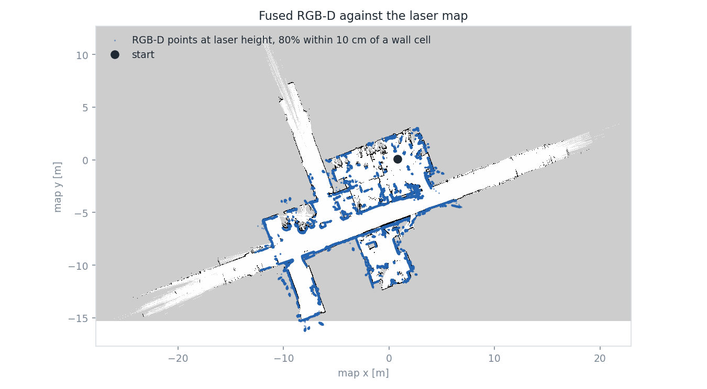

# Real robot data prep

`bags/playable_bag` (HSR, lab, 2026-08-11, 13 min, 92 GB) → Nav2 map → keyframes and fused cloud → Boxer 3D boxes → scene graph. The scripts live in `realrobot/`. The data they generate for this bag lands in `outputs/realrobot/lab_20260811/`. What the robot runs with goes in `config/realrobot/`: the Nav2 map and the transforms in `map/`, the scene graph in `scene_graph/`. Steps 1, 2 and 4 run from `/home/ws` in the container with ROS sourced; the rest run from the repository root. Step-by-step checklist for steps 3 and 5–8, with the full folder layout: [docker/boxer/README.md](../docker/boxer/README.md).

## Pipeline

| # | Command | Where | Time | Generates |
| --- | --- | --- | --- | --- |
| 1 | `bash realrobot/slam_replay.sh` | container | 6.5 min | `config/realrobot/map/lab_20260811.{pgm,yaml}` · `outputs/realrobot/lab_20260811/slam/{tf_mapping/,posegraph.data,posegraph.posegraph}` |
| 2 | `python3 realrobot/extract_rgbd.py --slam-tf outputs/realrobot/lab_20260811/slam/tf_mapping --output outputs/realrobot/lab_20260811/keyframes --registration config/realrobot/map/lab_20260811_scan_to_map.json` | container | 30 s | `outputs/realrobot/lab_20260811/keyframes/{color/,depth/,poses/,scene.ply,scene_mesh.ply,intrinsics.txt,keyframes.csv,stats.json}` · `config/realrobot/map/lab_20260811_scan_to_map.json` |
| 3 | `python3 realrobot/make_boxer_scene.py --source outputs/realrobot/lab_20260811/keyframes --output outputs/realrobot/lab_20260811/boxer/scannet/lab_20260811 --registration config/realrobot/map/lab_20260811_boxer_to_map.json` | anywhere | 1 s | `outputs/realrobot/lab_20260811/boxer/scannet/lab_20260811/frames/{color,depth,pose,intrinsic}/` · `config/realrobot/map/lab_20260811_boxer_to_map.json` |
| 4 | `cd realrobot && python3 visualize.py --scene ../outputs/realrobot/lab_20260811/keyframes --map ../config/realrobot/map/lab_20260811.yaml --slam-tf ../outputs/realrobot/lab_20260811/slam/tf_mapping --bag ../bags/playable_bag --figures figures` | container | 40 s | `realrobot/figures/{map_trajectory,map_keyframes,cloud_on_map,scene_topdown,keyframes}.png` · `checks.json` |
| 5 | `bash docker/boxer/run_boxer.sh --download-ckpts` | GPU host | once, 1 min | `docker/boxer/ckpts/` (1.2 GB) |
| 6 | `BOXER_CPU=1 BOXER_DATA=$PWD/outputs/realrobot/lab_20260811/boxer bash docker/boxer/run_boxer.sh --input /opt/boxer/sample_data/scannet/lab_20260811 --labels=scannet200 --fuse` | GPU host | ~40 min on CPU | `outputs/realrobot/lab_20260811/boxer/lab_20260811/{boxer_3dbbs.csv,boxer_3dbbs_fused.csv,owl_2dbbs.csv,boxer_viz_final.mp4}` |
| 7 | `python3 -m docker.boxer.to_scene_graph --boxes outputs/realrobot/lab_20260811/boxer/lab_20260811/boxer_3dbbs_fused.csv --transform config/realrobot/map/lab_20260811_boxer_to_map.json --output config/realrobot/scene_graph/lab_20260811.json` | container | 1 s | `config/realrobot/scene_graph/lab_20260811.json` |
| 8 | `python3 visualization/scene_graph.py --graph config/realrobot/scene_graph/lab_20260811.json --scene outputs/realrobot/lab_20260811/keyframes/scene.ply --output outputs/realrobot/lab_20260811/scene_graph.rrd` | container | 5 s | Rerun window · `outputs/realrobot/lab_20260811/scene_graph.rrd` |

- Steps 2 and 3 refuse to overwrite: delete or rename the output to rerun. Step 6 overwrites `outputs/realrobot/lab_20260811/boxer/lab_20260811/`.
- Steps 5 and 6 need Docker, so the GPU host.
- Step 6: `BOXER_CPU=1` keeps the container off the shared 16 GB GPU (another user's jobs held 12–13 GB). Drop it when `nvidia-smi` shows the card free. Stopped early? Ctrl-C, then `--cache3d --fuse` fuses what was saved ([README](../docker/boxer/README.md#stopped-step-2-early)). Never add `--start_n`.
- **Whole lab, one run.** Boxer lifts each 2D detection to a 3D box on its own and fuses afterwards, so there is no room-sized limit. `--stride N` in step 3 keeps every Nth keyframe for a faster run.
- Step 8: `--save-only` writes the recording without opening a window; `python3 -m rerun outputs/realrobot/lab_20260811/scene_graph.rrd` reopens it.
- After step 7: `python3 -m core.reasoner.query '<object>' --graph config/realrobot/scene_graph/lab_20260811.json` prints the search order.
- Replay navigation on the finished map and graph, with no robot: [realrobot/navigation/](README.md#realrobotnavigation).
- Real robot: Nav2 takes `map:=/home/ws/config/realrobot/map/lab_20260811.yaml`; the mission takes `--graph config/realrobot/scene_graph/lab_20260811.json` ([navigation README](../core/navigation/README.md#real-robot)). `launch/search.launch.py` is simulation-only.

## Files in `realrobot/`

| File | Step | Does |
| --- | --- | --- |
| `slam_replay.sh` | 1 | plays `/scan` + `/tf` at 2× into `sync_slam_toolbox_node`, records `map→odom`, saves map + pose graph |
| `slam_offline.yaml` | 1 | HSR `hsrb_mapping` params; offline changes marked in the file |
| `tf_filter.py` | 1 | forwards the bag's `/tf` minus its `map→odom` |
| `extract_rgbd.py` | 2 | pairs RGB/depth, poses them in the map, gates keyframes, fuses the TSDF, writes the registration |
| `make_boxer_scene.py` | 3 | keyframes (hardlinked, ids 0..N-1) in Boxer's ScanNet layout, plus the translation that undoes the loader's recentring |
| `visualize.py` | 4 | figures + `checks.json` |

## How each output is made

**Map (step 1).** The bag's own `map→odom` jumps by up to 8.7 m (77 jumps > 0.5 m), so `tf_filter.py` drops it and slam_toolbox rebuilds it. The replay runs on `ROS_DOMAIN_ID=87` because another ROS 2 system on this machine publishes `/tf`. The SLAM binary is started directly: killing a `ros2 run` wrapper leaves its node alive, and a second `map→odom` publisher silently corrupts the recording (`extract_rgbd.py` raises if that happens). After the bag ends, slam_toolbox keeps publishing the final `/map`; `map_saver_cli` saves it and `serialize_map` stores the pose graph.

| Map | Size | Resolution | Origin | Free / occupied / unknown |
| --- | --- | --- | --- | --- |
| `lab_20260811` | 1015 × 560 | 0.05 m | (−27.8, −15.3) | 73,638 / 7,176 / 487,586 |
| older `lab_20260811_run01` (was `config/real_map/`, deleted in the working tree) | 914 × 559 | 0.05 m | (−27.8, −15.3) | comparison only |

- Base path in the map 74 m; wheel odometry 75.6 m.
- `map→odom` corrections while mapping: 17 > 10 cm, largest 47 cm, 6.9 m total. Frames before a loop closure carry that pre-closure error.
- The long white rays are corridor views out to the 20 m raster range.

**Keyframes and scene (step 2).** Read straight from the bag, no playback.

| Stage | Rule | Result |
| --- | --- | --- |
| Pair RGB with depth | nearest stamps within 35 ms; an RGB waits for the next depth before matching | 7,768 pairs, 0 unmatched, 9 ms median gap |
| Camera pose | `map→odom` (SLAM) ∘ `odom→…→head_rgbd_sensor_rgb_frame` (bag TF), at the depth stamp | 12 frames skipped before SLAM's first pose |
| Keyframe gate | moved ≥ 10 cm or turned ≥ 5° | 580 keyframes |
| Save | `color/N.jpg` q95 · `depth/N.png` uint16 mm · `poses/N.txt` 4×4 camera→map | 345 MB |
| Fuse | Open3D scalable TSDF, 2 cm voxel, 8 cm truncation, depth ≤ 4 m | `scene.ply` 1.69 M points · mesh 2.95 M vertices · 20 × 20 × 3.2 m |
| Intrinsics | `camera_info` P matrix (images are rectified) as 4×4 | fx 533.92 fy 533.55 cx 317.61 cy 241.03 |

The RGB frame is optical (x right, y down, z forward): the bag's registered cloud equals the depth image unprojected to 0.01 mm. The head never moves and the torso sits at 0.77 m.

**Registration (step 2).** `lab_20260811_scan_to_map.json` is the identity with `source_frame: "map"`: every pose above is already in the SLAM map frame, so `scene.ply` is built in map coordinates. No ICP, nothing measured.

**Boxer sequence (step 3).** These keyframes already follow ScanNet's conventions, so they are hardlinked into `frames/{color,depth,pose}/` (ids 0..N-1), with `intrinsics.txt` as `frames/intrinsic/intrinsic_color.txt`. Boxer's ScanNet loader moves the origin to the first camera, map (0.768, 0.162, 1.015). `config/realrobot/map/lab_20260811_boxer_to_map.json` is that translation, with `source_frame: "boxer_lab_20260811"`. Gravity needs nothing: Boxer assumes world −z, and the map is z-up.

**Boxes and graph (steps 6–7), run of 2026-09-15.** Stopped early by hand, then fused from the saved boxes.

| Stage | Result |
| --- | --- |
| Frames lifted | 78 of 580 (keyframes 0–77, the start of the route), CPU at ~4 s a frame |
| Per-frame boxes | 984 across 45 classes; most: desk 150, monitor 111, chair 69, laptop 62, person 55 |
| Fused (confidence ≥ 0.55, seen ≥ 4 times) | 52 boxes |
| Graph | 45 nodes once 7 structure boxes are dropped: 11 furniture, 34 objects; edges 17 `on`, 3 `in`, 14 `near` |

- **Alignment:** top-down, every box sits on the fused cloud and inside the Nav2 walls. The bookshelf and cabinet stand against the east wall. The two rows of desks run along the south wall, with monitors, keyboards, laptops, a cup and a bottle `on` them.
- **Sizes:** desks 1.0–1.6 m × 0.7 m high, chairs ~0.9 m, cup 12 cm, keyboard 7 cm thick.
- **Wrong labels:** cables became `headphones` (2 nodes, `in` desk 18). Screens split into `tv` and `monitor`. A desk shelf became `ledge` (furniture, node 29). The robot arm was seen as `telephone` but never fused. People (`person`) moved, so never fused.
- **Rooms:** unnamed, so the reasoner sees furniture labels and positions only.

## Checks (step 4)

RGB-D points within ±5 cm of laser height (z = 0.19 m) against the nearest laser-occupied cell:

| Points | Median | ≤ 5 cm | ≤ 10 cm | ≤ 20 cm |
| --- | --- | --- | --- | --- |
| 41,019 | 5.0 cm | 62% | 80% | 91% |

Frame-to-model: each keyframe's depth unprojected with its pose, distance to the nearest `scene.ply` point. A right pose / intrinsics / depth-scale triple lands about one voxel (2 cm) away.

| Keyframe | 0 | 115 | 231 | 347 | 463 | 579 |
| --- | --- | --- | --- | --- | --- | --- |
| Median | 30 mm | 15 mm | 22 mm | 20 mm | 18 mm | 10 mm |
| ≤ 5 cm | 69% | 96% | 85% | 94% | 91% | 100% |

Keyframe 0 precedes the first loop closure. Neither check proves every object is in place: look at the step 8 view on the map before driving.

## Tried and rejected

| Idea | Result | Verdict |
| --- | --- | --- |
| Second pass in slam_toolbox `localization` mode against the pose graph | 64% of wall points within 10 cm vs 80% | worse; dropped |
| Second pass continuing mapping from the pose graph | not re-measured after stale nodes were found | dropped with the above |
| `ros2 run` + `kill` for SLAM | nodes survived, `map→odom` alternated between 4 values | binary started directly; conflict guard added |
| `ROS_LOCALHOST_ONLY=1` | node creation fails | clashes with the devcontainer's `CYCLONEDDS_URI`, which already pins `lo` |
| Reprojection check with sparse points | fake 1 m errors from occluded surfaces | replaced by frame-to-model |
| `rr.flush()` in `visualization/scene_graph.py` | missing in rerun 0.22 | flush the global recording instead |
